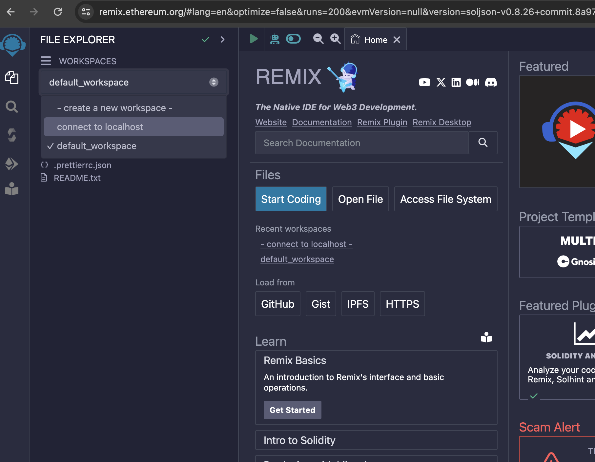

# Sample Solidity Staking Project 

This project is a Decentralized Staking Platform implemented in Solidity, designed to allow users to stake ERC-20 tokens and earn rewards based on a dynamic Annual Percentage Rate (APR). The contract is built with flexibility and security in mind, leveraging OpenZeppelin's standard libraries for enhanced functionality and security.

## Key Features
1. Staking Mechanism:
    Users can stake their ERC-20 tokens into the contract to earn rewards.
    The staking period is set to a fixed duration of 6 months (180 days).
2. Dynamic APR:
The staking rewards start with an APR of 200%.
If the Total Value Locked (TVL) in the contract reaches 10 million tokens, the APR is reduced to a flat rate of 20%.
3. Reward Calculation:
Rewards are calculated and distributed every 5 seconds.
The reward rate is adjusted based on the TVL and is updated dynamically.
4. User Functions:
    - Stake Tokens: Users can stake any amount of tokens to start earning rewards.
    - Unstake Tokens: Users can unstake their tokens at any time, provided they have enough staked.
    - Claim Rewards: Users can claim their accumulated rewards at any time.
5. Admin Functions:
    - Claim Tokens for User: Admin can claim rewards on behalf of a user.
    - Withdraw Tokens: Admin can withdraw tokens from the contract.
6. Event Logging:
Events are emitted for staking, unstaking, and claiming rewards to facilitate off-chain monitoring and debugging.

## Development and Deployment

1. Clone the repository
1. Install remixd
        
        npm i @remix-project/remixd 

3. Run remix daemon on locally
        
        npx remixd

4. Open Remix in [Browser](https://remix.ethereum.org)
5. Connect remix with localhost 

6. Compile the TestToken ontract and deploy
7. Compile and Deploy the StakingContract with the specified ERC-20 token contract address.
